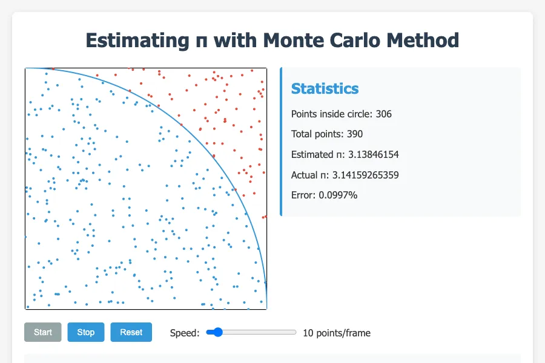

# Monte Carlo Pi Estimation Visualization

This project provides an interactive visualization of the Monte Carlo method for estimating the value of π (pi) using the pythagoream theorem too.



## How It Works

The Monte Carlo method for estimating π works by using random sampling to obtain numerical results. In this visualization:

1. We have a unit square (1×1) with a quarter circle of radius 1 inscribed within it.
2. The area of the square is 1, and the area of the quarter circle is π/4.
3. Random points are generated within the square.
4. We count how many points fall inside the quarter circle.
5. As the number of points increases, the ratio of points inside the circle to the total number of points approaches π/4.
6. Therefore, π can be estimated as: π ≈ 4 × (points inside circle / total points)

## Features

- Interactive visualization with start, stop, and reset controls
- Adjustable simulation speed
- Real-time statistics showing:
  - Number of points inside the circle
  - Total number of points
  - Current π estimation
  - Error percentage compared to the actual value of π
- Color-coded points (blue for inside the circle, red for outside)
- Responsive design that works on different screen sizes

## Screenshot

The screenshot shows the application in action with approximately 370 random points plotted. Blue points are inside the quarter circle, and red points are outside. The current estimation of π is displayed along with statistics about the simulation.

## Running the Application

Simply open the `index.html` file in any modern web browser to run the application:

```
open index.html
```

## Implementation

The project is implemented using:

- HTML5 Canvas for the visualization
- Vanilla JavaScript for the simulation logic
- CSS for styling and responsive design

## Files

- `index.html` - The main HTML structure
- `script.js` - JavaScript code for the simulation logic
- `styles.css` - CSS styles for the application
- `README.md` - This documentation file
